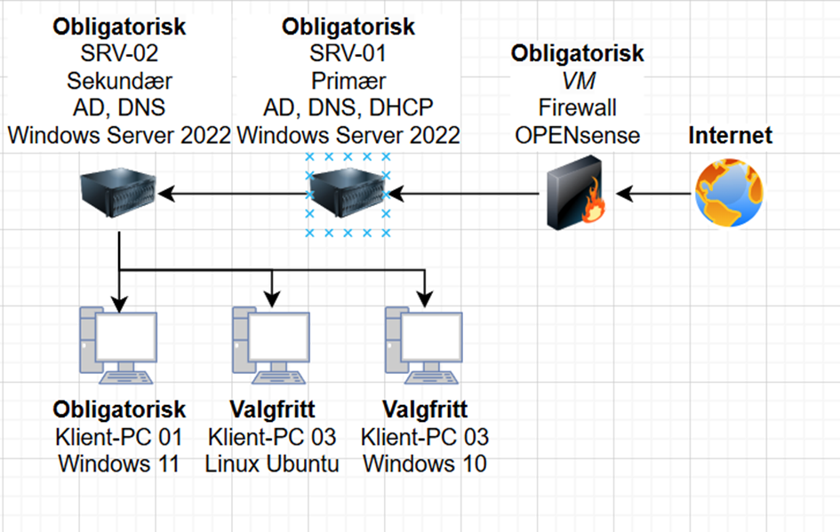

### Infrastructure for a Indie Company

### Table of content
- [1. Plan](#1-plan)
- [2. Before preparation](#2-before-preparation)
- [3. Needed hardware](#3-needed-hardware)
  - [3.1 Virtual infrastructure](#31-virtual-infrastructure)
  - [3.2 Pysical infrastructure](#32-pysical-infrastructure)
- [4. Learning points](#4-learning-points)

## 1. Plan
- The plan is to make an infrastructure for a small indie company, with similar functionality with other companies such as ``Stiftelsen Pilar``.

## 2. Before preparation
- The main task is to create the infrastructure using only virtual machines (VMs). The reasoning why I want to start with VMs and not physical machines (PMs) is that VMs are way safer in the way that if something goes sideways, I can just rollback to my last *"checkpoint"* and VMs are supposed to also be better for the goal achievement *(måloppnåelsen)*. On pysical machines it is way harder to revert back before I did the change, sometimes it's not even possible to revert back from a big change.

## 3. Needed hardware
The infrastructure will be containing:
-  ``1 Firewall`` 
-  ``2 Servers``
-  ``Minimum 1 Client PC``*(extras if I have time)*.  

### 3.1 Virtual infrastructure
Main objective is making the virtual infrastructure
- ``1 Firewall`` with ``OPNsense``
- ``2 Servers`` with ``Windows Server 2022``. 
  - **SRV-01**: ``Primary server``, ``AD DS``, ``DNS`` & ``DHCP``
  - **SRV-02**:``Secondary server (backup server)``, ``AD DS`` & ``DNS``
- **Minimum 1 Client PC**
  - **ClientPC-01**: ``Windows 11``
  - **ClientPC-02**: ``Linux Ubuntu``
  - **ClientPC-03**: ``Windows 10``
  - **ClientPC-04**: ``macOS`` 

### 3.2 Pysical infrastructure
After making the virtual infrastructure I will be creating the exact same infrastructure just pysically **IF I HAVE TIME**. For extra safety measures I will be doing every big change on the VMs so I don't mess anything up on the physical machines.
- ``1 Firewall`` with ``OPNsense``. **This will be a VM.**
- ``2 Servers`` with ``Windows Server 2022``. 
  - **SRV-01**: ``Primary server``, ``AD DS``, ``DNS`` & ``DHCP``
  - **SRV-02**:``Secondary server (backup server)``, ``AD DS`` & ``DNS``
- **Minimum 1 Client PC**
  - **ClientPC-01**: ``Windows 11``
  - **ClientPC-02**: ``Linux Ubuntu``
  - **ClientPC-03**: ``Windows 10``
  - **ClientPC-04**: ``macOS`` 

## 4. Learning points
Things I might learn from this:
- How to handle memory sticks
  - ``Format Hard Drives``
  - ``Bootable Drives (Using Rufus)``
- How to configure ``Windows Server 2022``
- ``Microsoft Azure``
- Problem solving, how to search the ``web`` for solutions
- Infrastructure planning
- The meaning and functions of ``AD DS``, ``DNS`` & ``DHCP``
- Security measures
- How to use Hyper-V
  - How to create many ``VMs``
  - How to create ``virtual switches``
- Use what's the ``best practice``

