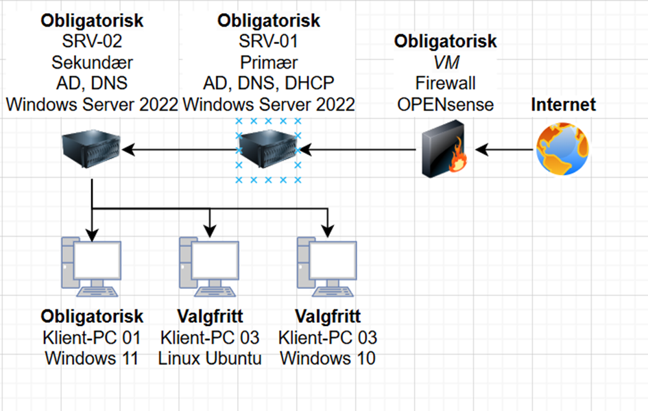

### Infrastructure for an Indie Company

### Table of Contents
- [1. Plan](#1-plan)
- [2. Before Preparation](#2-before-preparation)
- [3. Needed Hardware](#3-needed-hardware)
  - [3.1 Virtual Infrastructure](#31-virtual-infrastructure)
  - [3.2 Physical Infrastructure](#32-physical-infrastructure)
  - [3.3 Hardware Requirements *(Minimum Requirements)*](#33-hardware-requirements-minimum-requirements)
    - [3.3.1 How to Find What Hardware You Have](#331-how-to-find-what-hardware-you-have)
      - [3.3.1.1 ``Windows Server 2022``](#3311-windows-server-2022)
      - [3.3.1.2 ``OPNsense``](#3312-opnsense)
      - [3.3.1.3 ``Windows 11``](#3313-windows-11)
      - [3.3.1.4 ``Linux Ubuntu``](#3314-linux-ubuntu)
      - [3.3.1.5 ``Windows 10``](#3315-windows-10)
      - [3.3.1.6 ``macOS``](#3316-macos)
- [4. Learning Points](#4-learning-points)
  - [5. Documentation through images](#5-documentation-through-images)
  - [6. Source List](#6-source-list)
    - [6.1 Youtube](#61-youtube)
    - [6.2 Websites](#62-websites)

## 1. Plan
- The plan is to create an infrastructure for a small indie company with functionality similar to other companies such as ``Stiftelsen Pilar``.

## 2. Before Preparation
- The main task is to create the infrastructure using only virtual machines (VMs). The reasoning behind starting with VMs rather than physical machines (PMs) is that VMs are much safer. If something goes wrong, I can simply roll back to my last *"checkpoint"*, and VMs are also supposed to be better for achieving the goal *(måloppnåelsen)*. On physical machines, it is much harder to revert to the state before a change; sometimes it’s even impossible to undo a big change.

## 3. Needed Hardware
The infrastructure will consist of:
- ``1 Firewall``
- ``2 Servers``
- ``At least 1 Client PC`` *(extra PCs if time permits)*.

### 3.1 Virtual Infrastructure
The main objective is to create the virtual infrastructure:
- ``1 Firewall`` with ``OPNsense``
- ``2 Servers`` with ``Windows Server 2022``. 
  - **SRV-01**: ``Primary server``, ``AD DS``, ``DNS``, & ``DHCP``
  - **SRV-02**: ``Secondary server (backup server)``, ``AD DS`` & ``DNS``
- **At least 1 Client PC**
  - **ClientPC-01**: ``Windows 11``
  - **ClientPC-02**: ``Linux Ubuntu``
  - **ClientPC-03**: ``Windows 10``
  - **ClientPC-04**: ``macOS``

### 3.2 Physical Infrastructure
After creating the virtual infrastructure, I will replicate the exact same infrastructure physically **IF I HAVE TIME**. For extra safety, I will perform every major change on the VMs to avoid mistakes on the physical machines.
- ``1 Firewall`` with ``OPNsense``. **This will be a VM.**
- ``2 Servers`` with ``Windows Server 2022``. 
  - **SRV-01**: ``Primary server``, ``AD DS``, ``DNS``, & ``DHCP``
  - **SRV-02**: ``Secondary server (backup server)``, ``AD DS`` & ``DNS``
- **At least 1 Client PC**
  - **ClientPC-01**: ``Windows 11``
  - **ClientPC-02**: ``Linux Ubuntu``
  - **ClientPC-03**: ``Windows 10``
  - **ClientPC-04**: ``macOS``

### 3.3 Hardware Requirements *(Minimum Requirements)*
These apply to both VMs and PMs.
#### 3.3.1 How to Find What Hardware You Have
- **CPU**  
  - *You can use [``Coreinfo``](https://download.sysinternals.com/files/Coreinfo.zip), a tool included in Windows Sysinternals, to verify the capabilities of your CPU.*
- **RAM**
  - *You can check how much RAM you have in ``Settings > System > About > Device Specifications``.*
- **Storage**
  - *You can check how much storage you have in ``File Explorer > This PC``.*
- **Network**
  - *Go to ``Settings > Control Panel > Network and Internet > Network and Sharing Center > Change Adapter Settings``. In the list of network connections that opens, select the connection you are using to connect to your ISP (Wi-Fi or Ethernet).*

##### 3.3.1.1 ``Windows Server 2022`` 
- **CPU**
  - 1.4 GHz 64-bit processor
  - Compatible with x64 instruction set
  - Support for NX and DEP
  - Support for CMPXCHG16b, LAHF/SAHF, and PrefetchW instructions
  - Support for Second Level Address Translation (EPT or NPT)
- **RAM**
  - 512 MB for Server Core
  - 2 GB (2048 MB) for Server with ``Desktop Experience``
  - ECC (Error Correcting Code) or similar technology for physical host deployments
- **Storage**  
  - **The absolute minimum requirement is 32 GB**, but it is highly recommended to provide your server with as much storage as possible.
- **Network**
  - An Ethernet adapter capable of achieving at least 1 gigabit per second
  - Compliant with the PCI Express architecture specification

##### 3.3.1.2 ``OPNsense``
- **CPU**
  - Single-core 1 GHz processor
- **RAM**
  - 2 GB (2048 MB)
- **Storage**
  - 4 GB
- **Network**
  - At least 2 NICs (Network Interface Cards): one for the WAN and one for the LAN.

##### 3.3.1.3 ``Windows 11``
- **CPU**
  - 1 GHz or faster, 2 cores, 64-bit processor or SoC
- **RAM**
  - 4 GB (4096 MB) minimum
- **Storage**
  - 64 GB or larger
- **Network** *(optional)*
  - An internet connection is required for updates and features, and for the setup of Windows 11 Home edition (requires internet and a Microsoft account).

##### 3.3.1.4 ``Linux Ubuntu``
- **CPU**
  - 2 GHz dual-core processor 
- **RAM**
  - 4 GB (4096 MB) minimum
- **Storage**
  - 25 GB
- **Network**
  - Network interface card (NIC) for internet connectivity (Ethernet or Wi-Fi)

##### 3.3.1.5 ``Windows 10``
- **CPU**
  - 1 GHz or faster, 32-bit or 64-bit processor or SoC
- **RAM**
  - 1 GB (1024 MB) for 32-bit or 2 GB (2048 MB) for 64-bit
- **Storage**
  - 16 GB for 32-bit or 20 GB for 64-bit
- **Network**
  - An internet connection is required for updates and certain features

##### 3.3.1.6 ``macOS``
- **CPU**
  - Apple Silicon (M1 or newer) or Intel processor (Core i5 or later)
- **RAM**
  - 8 GB (8192 MB) minimum
- **Storage**
  - 256 GB
- **Network**
  - An internet connection is required for updates, features, and downloading apps from the Mac App Store.

## 4. Learning Points
Things I might learn from this:
- How to handle memory sticks
  - ``Format Hard Drives``
  - ``Bootable Drives (Using Rufus)``
- How to configure ``Windows Server 2022``
- ``Microsoft Azure``
- Problem-solving, how to search the ``web`` for solutions
- Infrastructure planning
- The meaning and functions of ``AD DS``, ``DNS``, & ``DHCP``
- Security measures
- How to use Hyper-V
  - How to create many ``VMs``
  - How to create ``virtual switches``
- Find and use ``best practices``

### 5. Documentation through images

### 6. Source List
This is all the sources I used to learn

#### 6.1 Youtube
- [KELVGLOBAL ICT](https://www.youtube.com/@Kelvglobal)
  - [How to add a Secondary Domain Controller to existing domain | Windows Server 2019](https://www.youtube.com/watch?v=dm3pTJGe0fo&list=PLMhhFwUvM0p7Y00NDmXHDShrUxRc0t6WL)
- [MSFT WebCast](https://www.youtube.com/@MSFTWebCast)
  - [How to Set up Secondary DNS Server in Windows Server 2019](https://www.youtube.com/watch?v=g9w8apZnbg0&list=PLMhhFwUvM0p7Y00NDmXHDShrUxRc0t6WL&index=3)
- [NETVN82](https://www.youtube.com/NETVN82)
  - [hvordan bygge en filserver for liten organisasjon eller liten bedrift](https://www.youtube.com/watch?v=6x4-vNmzuqU&list=PLMhhFwUvM0p7Y00NDmXHDShrUxRc0t6WL&index=3)
- [ittaster](https://www.youtube.com/@ittaster)
  - [How to Share Files & Folders | Windows Server 2022](https://www.youtube.com/watch?v=jw8NQBZjJ7A&t=893s)

#### 6.2 Websites
- [Microsoft Learn]([learn.microsoft.com](https://learn.microsoft.com/en-us/))
  - [Hardware requirements for Windows Server](https://learn.microsoft.com/en-us/windows-server/get-started/hardware-requirements?tabs=storage&pivots=windows-server-2022)
  - [Coreinfo v3.6](https://learn.microsoft.com/en-us/sysinternals/downloads/coreinfo)
  - [Naming conventions in Active Directory for computers, domains, sites, and OUs](https://learn.microsoft.com/en-us/troubleshoot/windows-server/active-directory/naming-conventions-for-computer-domain-site-ou)
  - [Find Windows 11 specs, features, and computer requirements](https://www.microsoft.com/en-us/windows/windows-11-specifications?r=1)
- [OPNsense documentation](https://docs.opnsense.org/index.html)
  - [Hardware sizing & setup](https://docs.opnsense.org/manual/hardware.html#hardware-requirements)